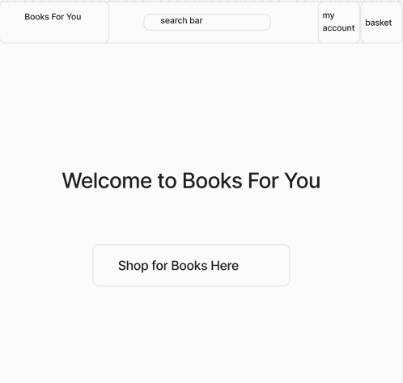
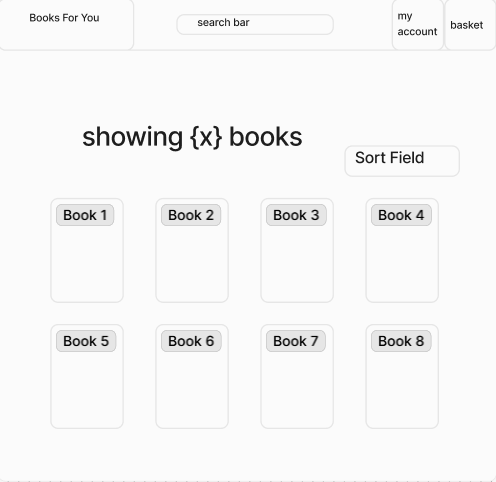
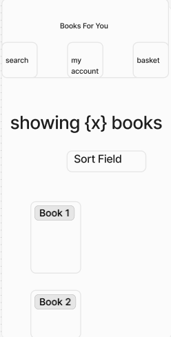

# 'Books For You' online Book Store

Deployed Website: [Books For You](https://books-for-you-19d767033b76.herokuapp.com/)

## CONTENTS

* [Project Goal](#Project-Goal)

* [User Experience (UX)](#User-Experience-UX)
  * [User Stories](#User-Stories)

  * [Design](#Design)
    * [Wireframes](#Wireframes)
    * [Typography](#Typography)
    * [Colour Scheme](#colour-palette)
    * [Features](#Features)

* [Technologies Used](#Technologies-Used)
  * [Languages Used](#Languages-Used)
  * [Frameworks & Other Libraries/Programs Used](#Frameworks--Other-LibrariesPrograms-Used)

* [Features](#Features)
  * [Main User Features](#main-user-features)
  * [Validation](#validation)
  * [Admin Only Features](#admin-only-features)

* [Database Schema](#Database-Schema)
  * [Entity Relationship Diagram](#Entity-Relationship-Diagram)

* [Deployment & Local Development](#Deployment--Local-Development)
  * [Deployment](#Deployment)
  * [Local Development](#Local-Development)
    * [Forking a Repository](#Forking-a-Repository)
    * [Cloning a Repository](#Cloning-a-Repository)

* [Testing](#Testing)
  
* [Credits](#Credits)
  * [Media](#Media)

## Project Goal 

The goal of the project was to create a simple, easy to use online bookstore, where users can add reviews for books, as well as purchase them from the store. Users can look through books based on their overall rating, and leave reviews of their own to recommend (or not recommend) books to other users.

## User Experience (UX)

### User Stories

#### Overall Client Goals

1. To be able to search for books on the site
2. To be able to leave reviews for books on the site
3. To be able to purchase books from the bookstore
4. To be able to create an account to keep track of one's order history

#### Site Owner Goals

1. To be able to add and delete books on the bookstore where necessary
2. To be able to take payments from users when they purchase a book.
3. To be able to edit or delete any review on the site, as a site superuser

### Design

#### Wireframes

##### Home Page

##### Book Search Page 

##### Add Book Page 

##### Add Review Page 

##### About Book Page

##### Checkout Page

##### Order Success Page

#### Typography

#### Colour Palette

### Technologies Used

#### Languages Used

The programming languages used for this project were:

* HTML5
* CSS3
* JavaScript
* Python3
* SQL

#### Frameworks & Other Libraries/Programs Used

* Git - Version Control
* Github - To save and store changes to the project
* Heroku - Used for project deployment
* [Django](https://www.djangoproject.com/) - Python based full-stack framework of which this entire site is built
* [jQuery](https://jquery.com/) - Library used when programming with JavaScript
* [PostgresSQL](https://www.postgresql.org/) - Used for manage databases for local development
* [Bootstrap (v5.3.2)](https://getbootstrap.com/) - CSS and JS framework used. Used mainly for the navbar, grid structure, and button styling.
* [Google Fonts](https://fonts.google.com/)- Imported selected fonts into external stylesheet, namely "Bungee Tint", "Montserrat", and "New Amsterdam."
* [Figma](https://www.figma.com/) - Used to create the wireframes.
* [Coolors](https://coolors.co/) - Used to create the colour palette images.
* [Favicon.io](https://favicon.io/) - To create favicon icons.
* [Shields.io](https://shields.io/) - Used to create badges.
* [Cloudinary](https://cloudinary.com/) - Used for hosting static files while deploying project.
* [W3C Markup Validation Service](https://validator.w3.org/) - Used for testing HTML validation.
* [W3C CSS Validation Service](https://jigsaw.w3.org/css-validator/) - Used for testing CSS validation.
* [Wave Web Accessibility Evaluation Tool](https://wave.webaim.org/extension/) - Used for testing webpage accessibility.
* [CI Python Linter](https://pep8ci.herokuapp.com/) - Used for checking the quality of the Python Code.

### Features (to be edited)

#### Main User Features

* 

##### 

#### Admin Only Features 

* The ability to add, edit and delete books from the database.

* The ability to add, edit and delete any user review from the database

#### Potential Future Feautures

Some potential features that I would like to include in the future:

* Enable users to have their own reading lists, where they can simply add books to this list that they may want to purchase in the future.
* To have the site recommend some books to the user depending on their previous purchases. For example, if the user has bought a few horror books recently, then the site will recommend some more horror books

## Database Schema

### Entity Relationship Diagram

### Tables and Relationships

Below are the tables and relationaships between the 5 tables in the database, as also reflected in the ERD above.

#### UserProfile

* id - Primary Key
* email 
* password 
* username
* reviews - one-to-many relationship with review table
* admin 

#### Book

* id - Primary Key
* name
* brand_id - Foreign Key - many-to-one relationship with brand table
* category_id - Foriegn Key - many-to-one relationship with category table
* reviews - one-to-many relationship with review table

#### Genre

* id - Primary Key
* brand_name 
* gear - one-to-many relationship with gear table

#### Review

* id - Primary Key
* category_name 
* gear - one-to-many relationship with gear table

## Deployment & Local Development

### Deployment

Github Pages and Heroku was used to deploy the live website. The instructions to achieve this are below:

1. Login to Heroku
2. Click "New", then "Create New App"
3. Enter a name for the app and choose your region.
4. Click "Create App"
5. Ensure your Github account is linked to your Heroku account.
6. On "Deployment Method" select "Github"
7. Search for and select your desired repository.
8. Choose "Settings", and click "Reveal Config Vars"
9. Here you can add your environment variables, which will be the following:
  * CLOUDINARY_API_KEY
  * CLOUDINARY_API_SECRET
  * CLOUDINARY_CLOUD_NAME
  * EMAIL_HOST_PASS
  * EMAIL_HOST_USER
  * SECRET_KEY
  * STRIPE_PUBLIC_KEY
  * STRIPE_SECRET_KEY
  * STRIPE_WH_SECRET
10. In your project settings.py file, make sure your Debug variable is set to False.
11. Go to "Deploy", and if you want, you can select "Enable Automatic Deploys", and make sure the branch is set to "main"
12. Go down to "Manual Deploy", select "main" branch, and click "Deploy Branch". Your project is now deployed.

### Local Development

#### Forking a Repository

To fork the repository:

  1. Log in or Sign Up to Github.
  2. Go to the repository for this project, DanArthur99/Milestone.Project.4
  3. Click the Fork button in the top right corner.

#### Cloning a Repository

To clone the repository:

  1. Log in or Sign Up to GitHub.
  2. Go to the repository for this project, DanArthur99 / Milestone-Project-3.
  3. Click on the code button, select whether you would like to clone with HTTPS, SSH or GitHub CLI and copy the link shown.
  4. Open the terminal in your IDE and set your working directory to the location you want to use for the cloned repository.
  5. Type 'git clone' into the terminal window, and paste the link from step 3, then press enter.
  6. Your cloned repository should now be located in your chosen directory
  7. Open your terminal window, and type in the following command, " pip install -r requirements.txt ". This will install all dependencies for this project onto your local machine or virtual environment.

  8. Create an .env file that contains the following variables:
    * CLOUDINARY_API_KEY
    * CLOUDINARY_API_SECRET
    * CLOUDINARY_CLOUD_NAME
    * EMAIL_HOST_PASS
    * EMAIL_HOST_USER
    * SECRET_KEY
    * STRIPE_PUBLIC_KEY
    * STRIPE_SECRET_KEY
    * STRIPE_WH_SECRET
  
  9. Assign these variables with all of your own secret keys.

  10. You are now ready ready for local development.

## Testing

[Testing](TESTING.md)

## Credits

### Media

