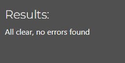
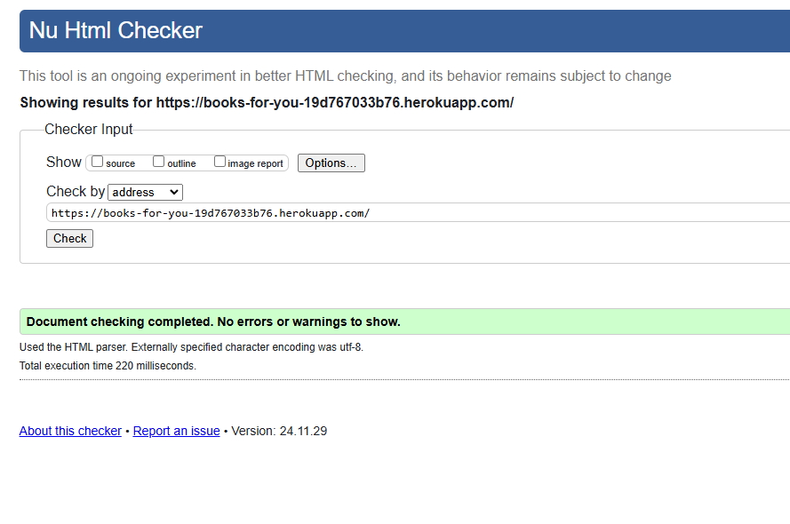
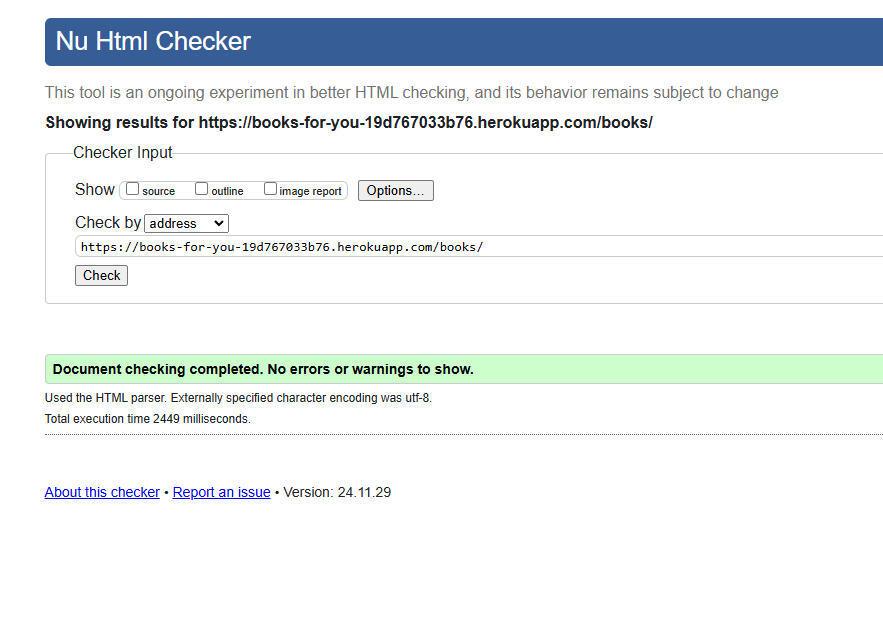
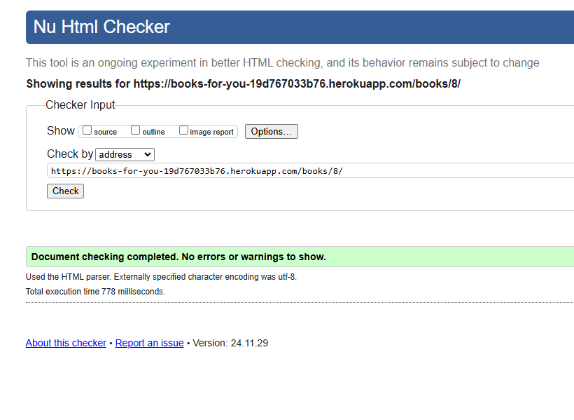
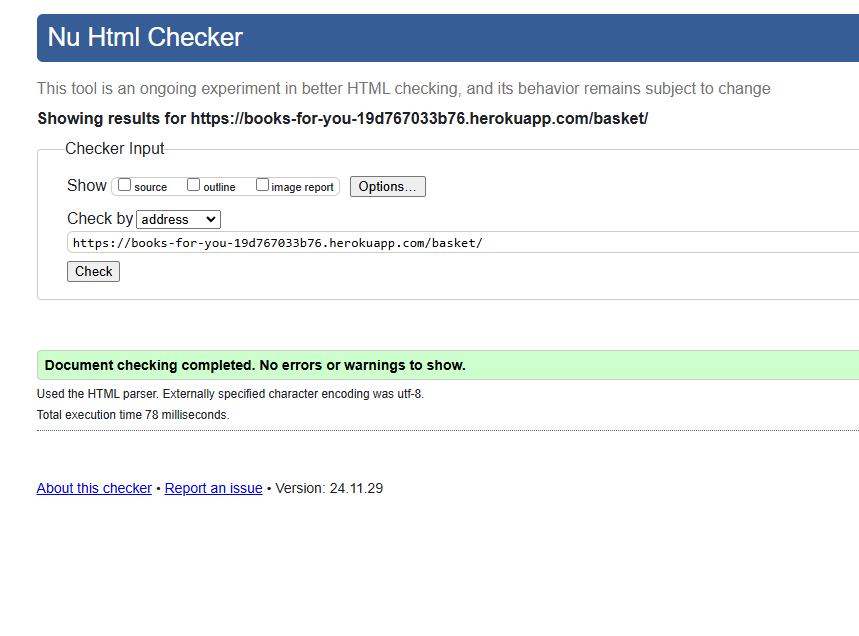
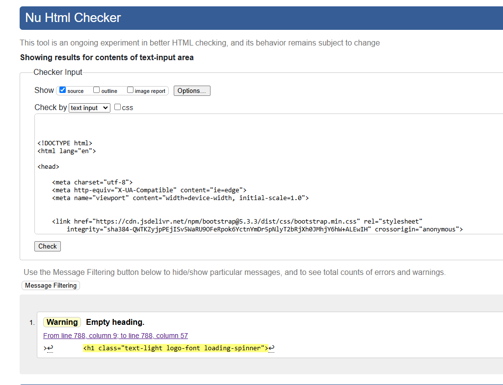
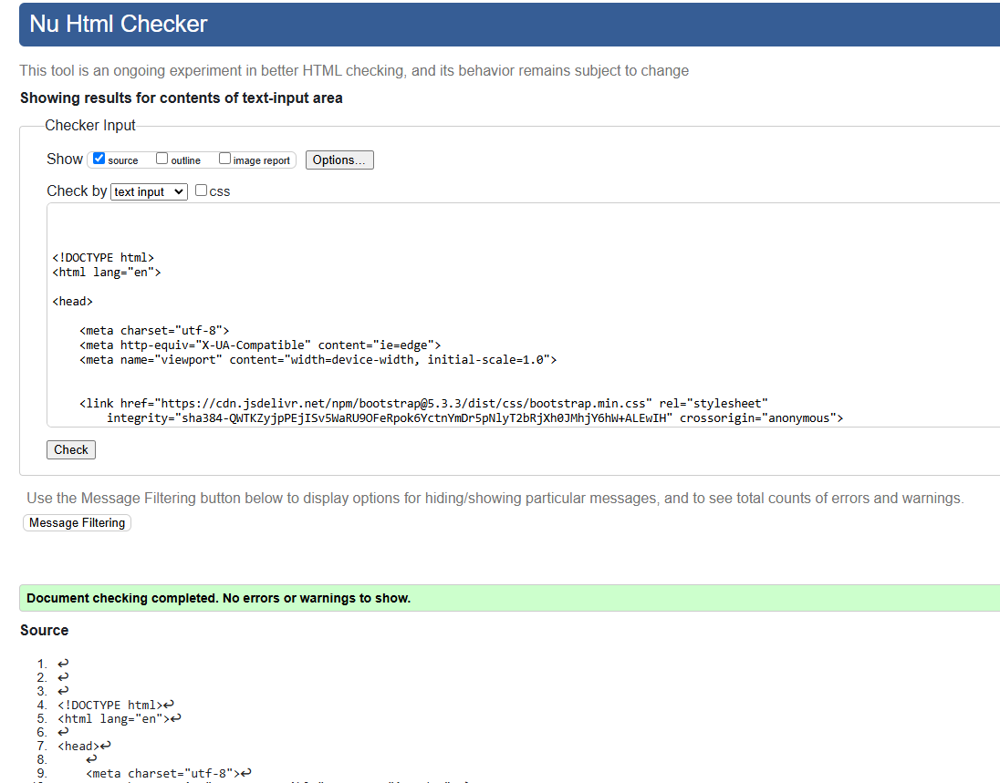
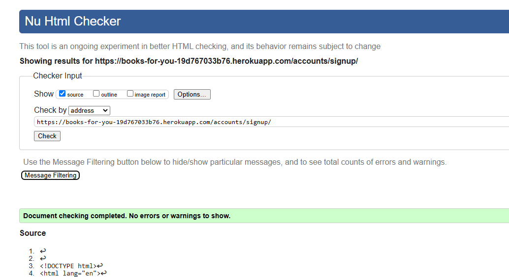
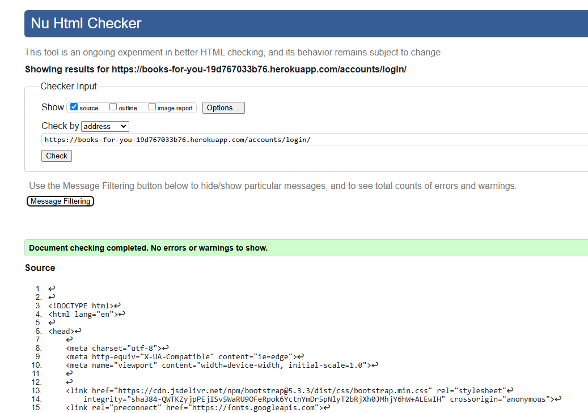
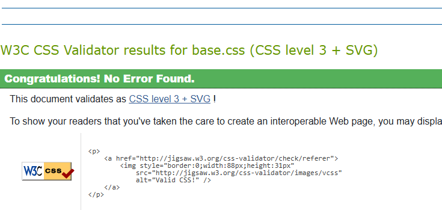

# Music Gear Review - Testing Document

## CONTENTS
* [Manual Testing](#Manual-Testing)
  * [Full Testing](#Full-Testing)
    * [Login and Sign Up](#login-and-sign-up-testing)
    * [CRUD Functionality](#crud-functionality)
    * [User Validation](#user-validation)
    * [Admin Features](#admin-features)
* [PythonLinter](#python-linter)
* [JavaScriptLinter](#javascript-linter)
* [W3C Validator](#W3C-Validator)
* [Wave Accessibiliy Testing](#Wave-Accessibility-TSesting)
* [Bugs](#Bugs)
  * [Solved Bugs](#Solved-Bugs)
* [Testing User Stories](#Testing-User-Stories)

## Manual Testing

### Full Testing

The site was tested on the following systems:

* Cyberpower Ryzen 5 - OS: Windows 11 v23H2
* Samsung Galaxy A52S 5G

This was also tested on the following browsers:

* Google Chrome - Version 125.0.6422.77 (64-bit)
* Microsoft Edge - Version 125.0.2535.51 (64-bit)
* Mozilla Firefox - Version 126.0 (64-bit)

#### Login and Sign Up Testing

**Test**|**Expected Outcome**|**Test Action**|**Result**|**Pass/Fail**
:-----:|:-----:|:-----:|:-----:|:-----:
Create User Account|Users data is added to the databse|Signed Up with a new username and email|New account created|Pass
Login test|The user should be logged in once they type in their email password to the login page|Enter email and passord|User is logged on|Pass
Incorrect email login test|The user should be informed that the user is not recognised|Enter wrong email and click submit|Flash message appears user is not logged on|Pass
Incorrect password login test|The user should be informed that the password is not recognised|Enter wrong password and click submit|Flash message appears user is not logged on|Pass
Incorrect email format test|The site should prompt the user to enter an email in the correct format|Enter an incorrect email format in the email field|Message pops up saying to use a valid email format|Pass
Unique Email and Username |The user cannot sign up with an email or username that already exists|Enter an existing email or username on the sign up page|Flash message appears saying an error occurred account is not created|Pass
Update Details|The user can change their username or email address to whatever they wish and the database will update|Click update details and change username|Username changed |Pass
Unique Email and Username #2|User cannot change their email or password to one that already exists|Enter a usernasme or email that already exists|Flash message appears saying an error occurred user is not updated|Pass
Update Password|User is able to update their password from their dashboard. This can be whatever they wish they can then log in using the new password|Change password then attempt to log in|User is logged in with new password|Pass
Login and sign up blank field test|If the user tries to submit either of these forms with a blank field then it will not submit the form and a message will appear saying the field is requeired|submit sign up form with blank field|User is prompted to fill in field form is not submitted|Pass

#### CRUD Functionality

**Test**|**Expected Outcome**|**Test Action**|**Result**|**Pass/Fail**
:-----:|:-----:|:-----:|:-----:|:-----:
Search function|User is able to use the search bar to search for for books |Type in harry in the search bar and click submit|Results appear on next page|Pass
Search blank test|Blank search is possible however it will just load all the books and an error pop up shoul appear|Blank search|User is prompted to enter something in the search bar via an error message|Pass
Add review|The user is able to select a product and write a review for this product which is then publically displayed|review is submitted|Review is now display on the product dashboard|Pass
Add review blank test|The user cannot submit a review with a blank field|Submit review with blank field|User is prompted to fill in field and form is not submitted|Admin update details|The admin user is able to access the update details page of any user|from the user dashboard click update details|User's update details page loads|Pass
Add review duplicate test|The user cannot write more than one review per product. It will display a message saying you've already submitted a review|Try to submit a second review for a product|Flash message appears saying you've already written a review|Pass
Add Product duplicate|user cannot add a product in the database that already exists|Attempt to submit a product with an existing name|Flash message appears saying an error occurred and product is not added|Pass
Edit review test|user is able to edit their own reviews|Click edit review and change the contents of the review|The review is updated and the changed are displayed|Pass
Delete review test|user is able to delete their own reviews|Click delete review|The review is removed from the database and review is no longer displayed|Pass

#### User Validation

**Test**|**Expected Outcome**|**Test Action**|**Result**|**Pass/Fail**
:-----:|:-----:|:-----:|:-----:|:-----:
User dashboard access test|The user is not authorised to access the dashboard of any other user|Copy user dashboard url then log into another user (non-admin) and paste url|Flash message appears saying user not authorised|Pass
User edit review access test|The user is not authorised to access the edit review page of any other user|Copy user edit review url then log into another user (non-admin) and paste url|Flash message appears saying user not authorised|Pass
User update details access test|The user is not authorised to access the update details page of any other user|Copy user edit review url then log into another user (non-admin) and paste url|Error message box appears saying user not authorised|Pass
User delete review access test|The user is not authorised to delete any other user's reviews|Copy user delete review url then log into another user (non-admin) and paste url|Flash message appears saying user not authorised|Pass

#### Admin Functionality and 'Add Book' testing

**Test**|**Expected Outcome**|**Test Action**|**Result**|**Pass/Fail**
:-----:|:-----:|:-----:|:-----:|:-----:
author field blank test|The admin user cannot submit a blank field |Click add brand and click submit while brand name field is empty|user is prompted for field data|Pass
book title field blank test|The site should prompt the user to add a book title|submit form with title left blank|form prompts for author to enter a title|Pass
price field blank test|The site should prompt the user to add a price for the book|submit form with price left blank|form prompts for author to enter price|Pass
Admin edit reviews|The admin is able to edit any user's reviews |Click on a user's dashboard then click on the link to see their reviews choose any review and edit it|the edit review page loads and when the admin user clicks submit the edited review is displayed|Pass
Admin delete reviews|The admin is able to delete any user's reviews |Click on a user's dashboard then click on the link to see their reviews choose any review and click delete review|Modal appears for a double check then review is deleted from database when yes is clicked|Pass

## Python Linter

All .views, .urls, .models, and .contexts pass the CI python linter with no errors.

## JavaScript Linter

## W3C Validation Checker

### Home Page

### Books Page

### About Book Page

### Basket Page

### Checkout Page

* Only 1 warning comes up about there being no text in the h1 tag. However this is because the font awesome spinner is inside instead.

### Checkout Success Page

### Sign Up Page

### Dashboard

### Stylesheet Validators

#### base.css

## Wave Accessibility Testing

### Home Page

### Sign Up Page

### Login Page

### Brands Page

### Categories Page

### Search Page

## Bugs

### Solved Bugs

This checker and variations of it has been used throughout the routes.py file to check if the user has the correct authorisation.

## Testing User Stories

### Overall Client Goals

1. To be able to search for items within the database

2. To be able read reviews for different items within the database

3. To be able to add new products to the database, if a user cannot see their desired product

### First Time Visit Goals

1. To be able to sign up to the site with a unique username and password

2. To be able to leave/delete their own reviews for a specific product

### Returning Visitor Goals

1. To be able to have a unique account that they can login into (created from signing up)

2. To be able to edit their account information, i.e. username and password

3. To be able to view their own reviews easily.

4. To be able to delete their personal accounts if they wish

