# Music Gear Review - Testing Document

## CONTENTS
* [Manual Testing](#Manual-Testing)
  * [Full Testing](#Full-Testing)
    * [Login and Sign Up](#login-and-sign-up-testing)
    * [User CRUD Functionality](#user-crud-functionality)
    * [Defensive Programming Tests](#defensive-programming-tests)
    * [Admin Functionality](#admin-functionality)
    * [Add Book Testing](#add-book-testing)
    * [Payment System and Checkout Testing](#payment-system-and-checkout-testing)
* [PythonLinter](#python-linter)
* [JavaScriptLinter](#javascript-linter)
* [W3C Validator](#W3C-Validator)
* [Wave Accessibiliy Testing](#Wave-Accessibility-TSesting)
* [Bugs](#Bugs)
  * [Solved Bugs](#Solved-Bugs)
* [Testing User Stories](#Testing-User-Stories)

## Manual Testing

### Full Testing

The site was tested on the following systems:

* Cyberpower Ryzen 5 - OS: Windows 11 v23H2
* Samsung Galaxy A52S 5G

This was also tested on the following browsers:

* Google Chrome - Version 125.0.6422.77 (64-bit)
* Microsoft Edge - Version 125.0.2535.51 (64-bit)
* Mozilla Firefox - Version 126.0 (64-bit)

#### Login and Sign Up Testing

**Test**|**Expected Outcome**|**Test Action**|**Result**|**Pass/Fail**
:-----:|:-----:|:-----:|:-----:|:-----:
Create User Account|Users data is added to the databse|Signed Up with a new username and email|New account created|Pass
Login test|The user should be logged in once they type in their email password to the login page|Enter email and passord|User is logged on|Pass
Incorrect email login test|The user should be informed that the user is not recognised|Enter wrong email and click submit|Flash message appears user is not logged on|Pass
Incorrect password login test|The user should be informed that the password is not recognised|Enter wrong password and click submit|Error messaged appears and user is not logged on|Pass
Incorrect email format test|The site should prompt the user to enter an email in the correct format|Enter an incorrect email format in the email field|Message pops up saying to use a valid email format|Pass
Unique Email and Username |The user cannot sign up with an email or username that already exists|Enter an existing email or username on the sign up page|Flash message appears saying an error occurred account is not created|Pass
Update Details|The user can update their address details on their profile page update|Click fill out the new details and click update|Details changed |Pass
Unique Email and Username #2|User cannot change their email or password to one that already exists|Enter a usernasme or email that already exists|Flash message appears saying an error occurred user is not updated|Pass
Update Password|User is able to update their password from their dashboard. They can then log in using the new password|Change password then attempt to log in|User is logged in with new password|Pass
Login and sign up blank field test|If the user tries to submit either of these forms with a blank field then it will not submit the form and a message will appear saying the field is requeired|submit sign up form with blank field|User is prompted to fill in field form is not submitted|Pass
Confirmation Email|A confirmation email with a link should be sent to new users|sign up with a brand new email|A confirmation email appers in the recipient's inbox with a confirm email link inside|Pass

#### User CRUD Functionality

**Test**|**Expected Outcome**|**Test Action**|**Result**|**Pass/Fail**
:-----:|:-----:|:-----:|:-----:|:-----:
Search function|User is able to use the search bar to search for for books |Type in harry in the search bar and click submit|Results appear on next page|Pass
Search blank test|Blank search is possible however it will just load all the books and an error pop up shoul appear|Blank search|User is prompted to enter something in the search bar via an error message|Pass
Add review|The user is able to select a product and write a review for this product which is then publically displayed|review is submitted|Review is now display on the product dashboard|Pass
Add review blank test|The user cannot submit a review with a blank field|Submit review with blank field|User is prompted to fill in field and form is not submitted|Admin update details|The admin user is able to access the update details page of any user|from the user dashboard click update details|User's update details page loads|Pass
Add review duplicate test|The user cannot write more than one review per book. It will display an error message saying they have already written a review|Try to submit a second review for a product|Error message appears saying you've already written a review|Pass
Edit review test|user is able to edit their own reviews|Click edit review and change the contents of the review|The review is updated and the changed are displayed|Pass
Delete review test|user is able to delete their own reviews|Click delete review|The review is removed from the database and review is no longer displayed|Pass

#### Defensive Programming Tests

**Test**|**Expected Outcome**|**Test Action**|**Result**|**Pass/Fail**
:-----:|:-----:|:-----:|:-----:|:-----:
User edit review access test|A regular user is not authorised to access the edit review page of any other user|Copy user edit review url then log into another user (non-admin) and paste url|Message appears saying user not authorised and user is redirected to homepage|Pass
User delete review access test|The user is not authorised to delete any other user's reviews|Copy user delete review url then log into another user (non-admin) and paste url|Flash message appears saying user not authorised|Pass
User add book|A user is not authorized to access to functionality so should be booted away|Copy add book url from admin account then log in to a regular user account. Paste and press enter|An error message appears saying that is action is forbidden for the user and user is redirected|Pass
User delete book|A user is not authorized to access this functionality so should be booted away|Copy delete book url from admin account then log in to a regular user account|An error message appears saying that is action is forbidden for the user and user is redirected|Pass
404 test|User should be redirected to a 404 page if the URL is unknown|Enter a random string after the base url|User is taken to a site themed 404 page|Pass

#### Admin Functionality

**Test**|**Expected Outcome**|**Test Action**|**Result**|**Pass/Fail**
:-----:|:-----:|:-----:|:-----:|:-----:
Admin edit reviews|The admin is able to edit any user's reviews |lick on any book and any review then click the delete button|the edit review page loads and when the admin user clicks submit the edited review is displayed|Pass
Admin delete reviews|The admin is able to delete any user's reviews|click on any book and any review then click the delete button|A new page loads for a double check and the review is deleted from database when yes is clicked|Pass

#### Add Book testing

**Test**|**Expected Outcome**|**Test Action**|**Result**|**Pass/Fail**
:-----:|:-----:|:-----:|:-----:|:-----:
author field blank test|The admin user cannot submit a blank field |Click submit with author field empty|user is prompted for field data|Pass
book title field blank test|The site should prompt the user to add a book title|try to submit form with title left blank|form prompts for user to enter a title|Pass
price field blank test|The site should prompt the user to add a price for the book|try to submit form with price left blank|form prompts for user to enter price|Pass
pages blank field test|The site should prompt the user to enter a value to the pages form field|try to submit form with pages left blank|form prompts for user to enter pages|Pass
pages blank negative number test|The site should tell the user they must enter a value greater than or equal to 0| try to submit form with pages set as a negative number|form prompts for user to enter a value greater than or equal to 0|Pass
language blank field test|The site should prompt the user to enter a value to the language form field|try to submit form with langauge field left blank|form prompts for user to enter language|Pass
year of publish blank field test|The site should prompt the user to enter a year of publish|try to submit form with year of publish left blank|form prompts for user to enter a year of publish|Pass
year of publish future year test|an error message should appear saying the value has to be smaller or equal to the current year|try to submit form with year of publish in the future|form refreshes with an error message saying they must enter a value smaller than or equal to whatever the current year is|Pass
genres unselected field test|The site should prompt the select a value from this field|try to submit form with a genre not selected|form prompts for user to choose a value|Pass
image unchosen test|It is ok if there is not image of the book. However, a noimage image should appear in its place rather than the default alt label|add a new book with no image|The noimage png file appears in it's place|Pass

#### Payment System and Checkout testing

**Test**|**Expected Outcome**|**Test Action**|**Result**|**Pass/Fail**
:-----:|:-----:|:-----:|:-----:|:-----:
Add to basket test|A user is able to add a book to their basket|click add to basket on any 'about book' page|the book appears in their basket|Pass
paymentintent created test|A stripe payment intent is created when a user enters the checkout page|Navigate to the checkout page, then check the connected stripe account and view stripe events|A paymentintent.create is seen|Pass
Invalid card test|If a card number is invalid, then an error will appear to the user informing them|Enter a deliberately incorrect card number|Error message appears immediate saying card is invalid|Pass
Phone number blank test|User should be prompted to enter a phone number|attempt to complete order without setting a phone number|User is prompted to enter a phone number|Pass
Street address 1 blank test|User should be prompted to fill out the field|attempt to complete order wuth setting this field|User is prompted to fill ou the field|Pass
Town or City blank test|User should be prompted to fill out the town filed|attempt to complete order wuth setting this field|User is prompted to fill ou the field|Pass
Email test on order completion|User should recieve an order confirmation email once an order is placed|Place an order as any user|An order confirmation is send to the user's email, containing their order number|Pass

## Python Linter

* All .views, .urls, .models, and .contexts pass the CI python linter with no errors.

## JavaScript Linter

* All the js scripts throughou the project passed the JS Linter. The only issue being the 'Stripe' variable being undefined. However, this is because it is obtained using the stripe CDN in the HTML.

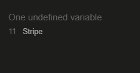

## W3C Validation Checker

### Home Page

### Books Page

### About Book Page

### Basket Page

### Checkout Page

* Only 1 warning comes up about there being no text in the h1 tag. However this is because the font awesome spinner is inside instead.

### Checkout Success Page

### Sign Up Page

### Dashboard

### Add Book

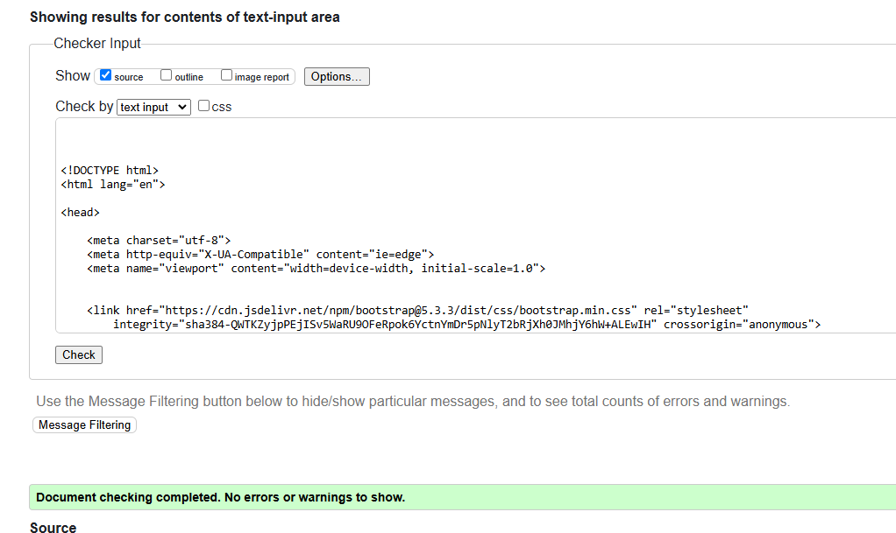

### Stylesheet Validator

## Wave Accessibility Testing

### Home Page

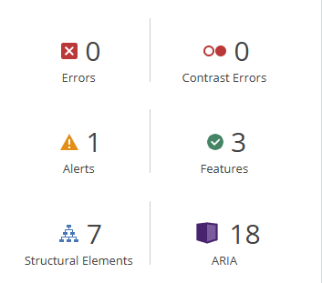
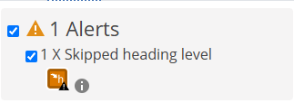

### Books Page

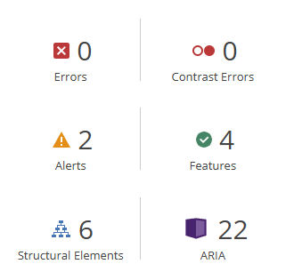
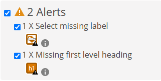

### About Book

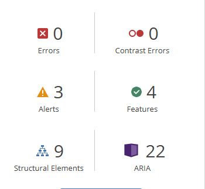
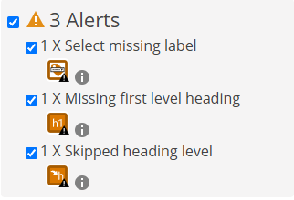

### Basket

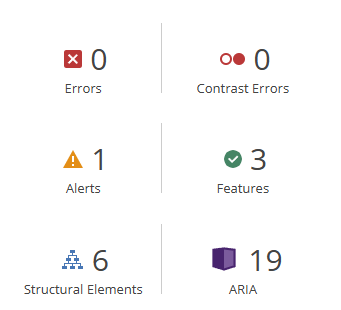
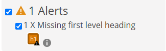

## Bugs

### Solved Bugs

* One problem I came across was that I was struggling to host my static files. To fix this, I used cloudinary instead of AWS and set the config settings in my settings.py file to these variables.

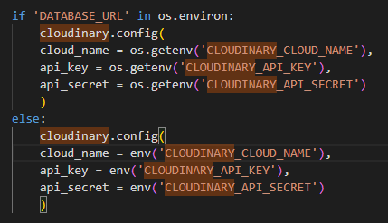

* I encountered a problem where the order number that the user was receiving in thier email was not the once they were being shown on their screen. It turns out that it was duplicating every order being placed due to the checks done by the webhook handler. To fix this, I altered the syntax slightly to use get_object_or_404, using the pid as the unique key, rather than trying to use object.get( ..etc... ). This appears to have fixed the issue.

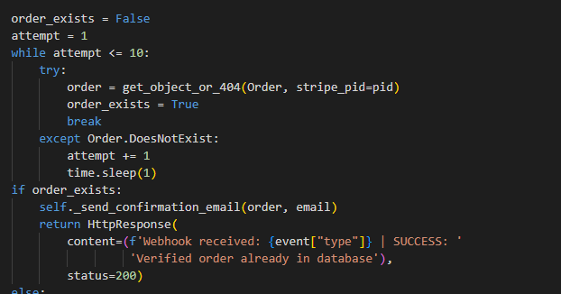

### Known Bugs

* At the moment, while not technically a bug, duplicate book entries are possible. This is not a major issue as it doesn't massively affect a normal user's experience, as well as being entirely controlled by the admin side. However, this would be something I would like to ammend in the future.

## Testing User Stories

#### Overall Client Goals

1. To be able to search for books on the site

2. To be able to leave reviews for books on the site

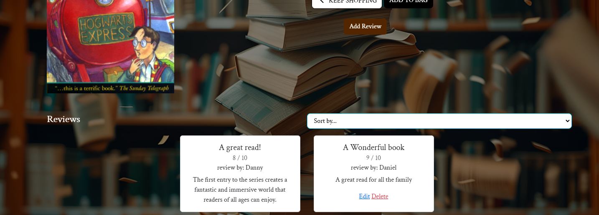

3. To be able to purchase books from the bookstore

4. To be able to create an account to keep track of one's order history

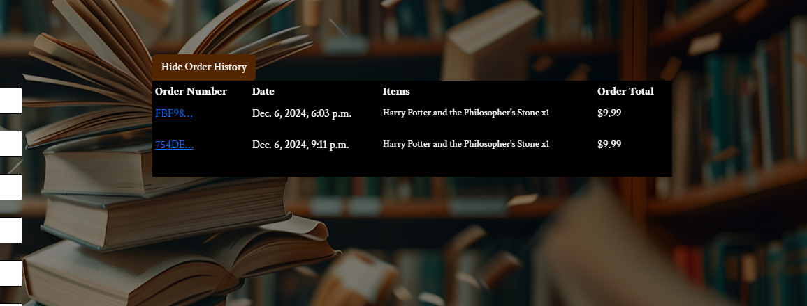

#### Site Owner Goals

1. To be able to add and delete books on the bookstore where necessary

2. To be able to take payments from users when they purchase a book.

* Using Stripe, the site owner is able to take payments from customers, as evidenced by these webhooks.

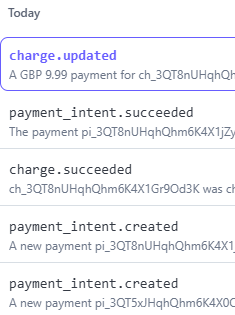

3. To be able to edit or delete any review on the site, as a site superuser

